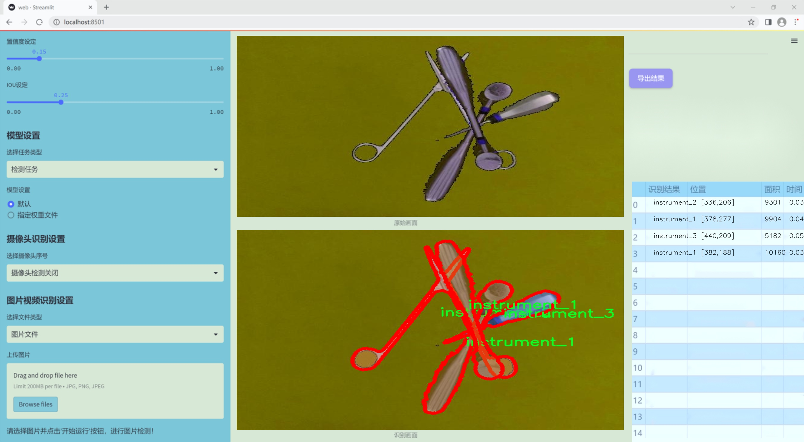
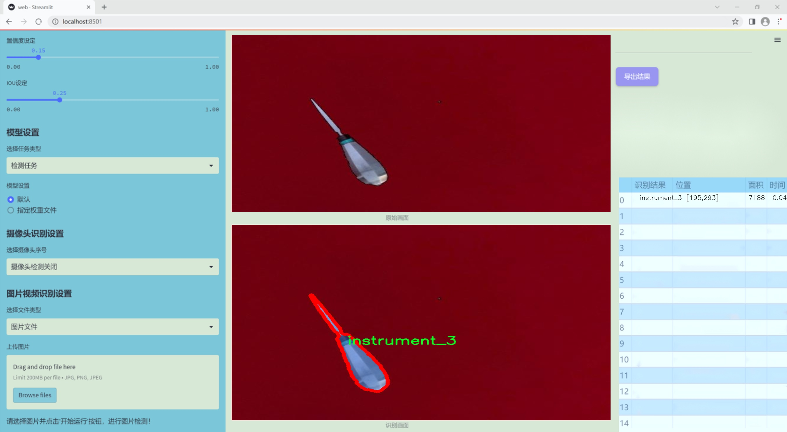
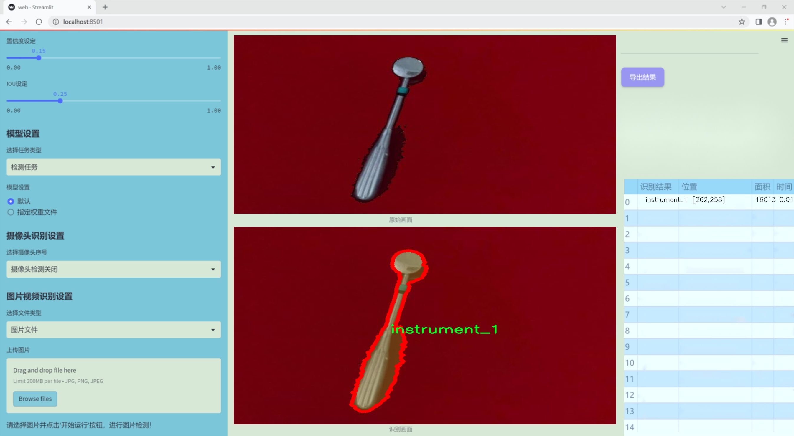
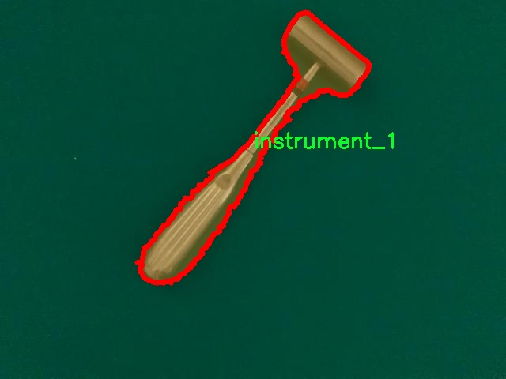
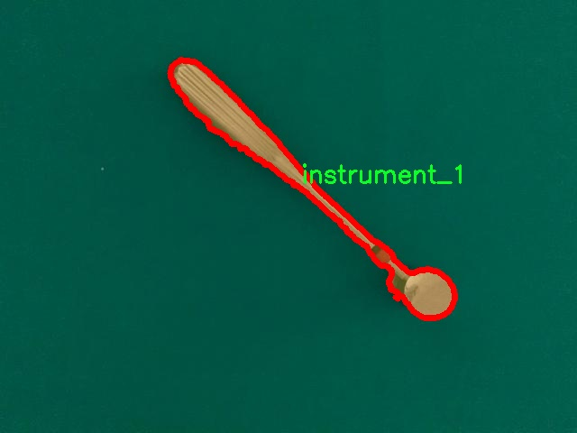
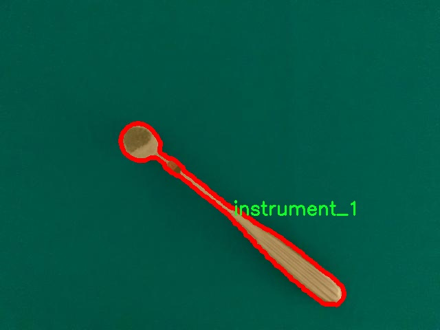
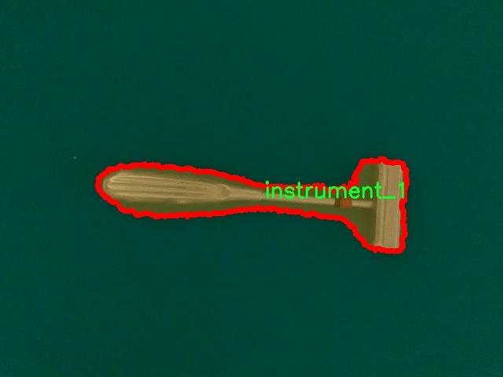
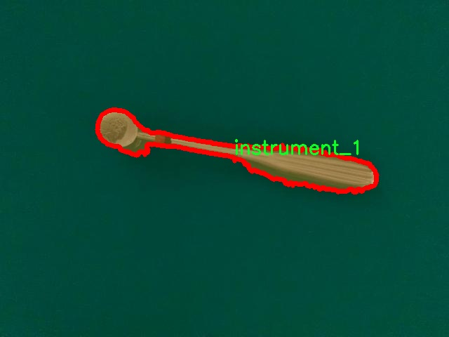

### 1.背景意义

研究背景与意义

随着医疗技术的不断进步，外科手术的复杂性和精确性要求也随之提高。在外科手术中，外科工具的准确识别与定位对于提高手术的安全性和有效性至关重要。传统的手术工具识别方法往往依赖于人工观察和经验判断，容易受到人为因素的影响，导致识别精度不足。因此，基于计算机视觉的自动化工具识别系统应运而生，成为提升外科手术质量的重要手段。

本研究旨在开发一个基于改进YOLOv11的外科工具实例分割系统。YOLO（You Only Look Once）系列模型因其高效的实时检测能力而广泛应用于目标检测领域。通过对YOLOv11进行改进，我们期望能够提高其在外科工具实例分割任务中的性能，尤其是在处理多类别工具时的精确度和鲁棒性。我们的数据集包含1600张图像，涵盖7种不同的外科工具，这为模型的训练和评估提供了丰富的样本。

在实例分割任务中，模型不仅需要识别工具的类别，还需精确地分割出每个工具的轮廓。这一能力对于手术机器人、增强现实手术导航系统等应用具有重要意义。通过精确的工具分割，手术机器人可以更好地执行任务，减少对外科医生的依赖，同时增强现实系统能够提供更为直观的手术指导，提升手术的安全性和成功率。

综上所述，基于改进YOLOv11的外科工具实例分割系统的研究，不仅能够推动计算机视觉技术在医疗领域的应用，还将为外科手术的智能化发展提供有力支持。通过本研究，我们希望为未来的外科手术提供更为高效、安全的技术解决方案。

### 2.视频效果

[2.1 视频效果](https://www.bilibili.com/video/BV1Z6kQYREAE/)

### 3.图片效果







##### [项目涉及的源码数据来源链接](https://kdocs.cn/l/cszuIiCKVNis)**

注意：本项目提供训练的数据集和训练教程,由于版本持续更新,暂不提供权重文件（best.pt）,请按照6.训练教程进行训练后实现上图演示的效果。

### 4.数据集信息

##### 4.1 本项目数据集类别数＆类别名

nc: 7
names: ['instrument_1', 'instrument_2', 'instrument_3', 'instrument_4', 'instrument_5', 'instrument_6', 'instrument_7']


该项目为【图像分割】数据集，请在【训练教程和Web端加载模型教程（第三步）】这一步的时候按照【图像分割】部分的教程来训练

##### 4.2 本项目数据集信息介绍

本项目数据集信息介绍

本项目所使用的数据集专注于外科工具的实例分割，旨在为改进YOLOv11模型提供高质量的训练数据。该数据集包含七个类别的外科工具，具体类别包括：instrument_1、instrument_2、instrument_3、instrument_4、instrument_5、instrument_6和instrument_7。这些类别涵盖了外科手术中常用的各种工具，确保了模型在实际应用中的广泛适用性和准确性。

数据集的构建过程经过精心设计，确保每个类别的样本均具有足够的多样性和代表性。通过对不同手术场景和操作环境的采集，数据集不仅包含了各种外科工具在不同角度、光照条件下的图像，还涵盖了工具在使用过程中的动态变化。这种多样性使得模型能够更好地学习到工具的特征，进而提高实例分割的精度。

此外，数据集中的每个图像都经过精确标注，确保每个外科工具的轮廓清晰可辨。标注过程中，采用了先进的图像处理技术，以提高标注的准确性和一致性。这一过程不仅提高了数据集的质量，也为后续的模型训练提供了坚实的基础。

在数据集的使用过程中，研究团队将重点关注如何利用YOLOv11的优势，结合实例分割技术，提升外科工具的识别和定位能力。通过不断迭代和优化模型，期望能够在外科手术的自动化和智能化方面取得显著进展，为外科医生提供更为精准的辅助工具，从而提升手术的安全性和效率。总之，本项目的数据集为外科工具实例分割系统的研究与开发提供了重要的支持和保障。











### 5.全套项目环境部署视频教程（零基础手把手教学）

[5.1 所需软件PyCharm和Anaconda安装教程（第一步）](https://www.bilibili.com/video/BV1BoC1YCEKi/?spm_id_from=333.999.0.0&vd_source=bc9aec86d164b67a7004b996143742dc)


[5.2 安装Python虚拟环境创建和依赖库安装视频教程（第二步）](https://www.bilibili.com/video/BV1ZoC1YCEBw?spm_id_from=333.788.videopod.sections&vd_source=bc9aec86d164b67a7004b996143742dc)

### 6.改进YOLOv11训练教程和Web_UI前端加载模型教程（零基础手把手教学）

[6.1 改进YOLOv11训练教程和Web_UI前端加载模型教程（第三步）](https://www.bilibili.com/video/BV1BoC1YCEhR?spm_id_from=333.788.videopod.sections&vd_source=bc9aec86d164b67a7004b996143742dc)


按照上面的训练视频教程链接加载项目提供的数据集，运行train.py即可开始训练



     Epoch   gpu_mem       box       obj       cls    labels  img_size
     1/200     20.8G   0.01576   0.01955  0.007536        22      1280: 100%|██████████| 849/849 [14:42<00:00,  1.04s/it]
               Class     Images     Labels          P          R     mAP@.5 mAP@.5:.95: 100%|██████████| 213/213 [01:14<00:00,  2.87it/s]
                 all       3395      17314      0.994      0.957      0.0957      0.0843

     Epoch   gpu_mem       box       obj       cls    labels  img_size
     2/200     20.8G   0.01578   0.01923  0.007006        22      1280: 100%|██████████| 849/849 [14:44<00:00,  1.04s/it]
               Class     Images     Labels          P          R     mAP@.5 mAP@.5:.95: 100%|██████████| 213/213 [01:12<00:00,  2.95it/s]
                 all       3395      17314      0.996      0.956      0.0957      0.0845

     Epoch   gpu_mem       box       obj       cls    labels  img_size
     3/200     20.8G   0.01561    0.0191  0.006895        27      1280: 100%|██████████| 849/849 [10:56<00:00,  1.29it/s]
               Class     Images     Labels          P          R     mAP@.5 mAP@.5:.95: 100%|███████   | 187/213 [00:52<00:00,  4.04it/s]
                 all       3395      17314      0.996      0.957      0.0957      0.0845


###### [项目数据集下载链接](https://kdocs.cn/l/cszuIiCKVNis)

### 7.原始YOLOv11算法讲解


###### YOLOv11改进方向

与YOLOv 10相比，YOLOv 11有了巨大的改进，包括但不限于：

  * 增强的模型结构：模型具有改进的模型结构，以获取图像处理并形成预测
  * GPU优化：这是现代ML模型的反映，GPU训练ML模型在速度和准确性上都更好。
  * 速度：YOLOv 11模型现在经过增强和GPU优化以用于训练。通过优化，这些模型比它们的前版本快得多。在速度上达到了25%的延迟减少！
  * 更少的参数：更少的参数允许更快的模型，但v11的准确性不受影响
  * 更具适应性：更多支持的任务YOLOv 11支持多种类型的任务、多种类型的对象和多种类型的图像。

###### YOLOv11功能介绍

Glenn Jocher和他的团队制作了一个令人敬畏的YOLOv 11迭代，并且在图像人工智能的各个方面都提供了YOLO。YOLOv 11有多种型号，包括：

  * 对象检测-在训练时检测图像中的对象
  * 图像分割-超越对象检测，分割出图像中的对象
  * 姿态检测-当用点和线训练时绘制一个人的姿势
  * 定向检测（OBB）：类似于对象检测，但包围盒可以旋转
  * 图像分类-在训练时对图像进行分类

使用Ultralytics Library，这些模型还可以进行优化，以：

  * 跟踪-可以跟踪对象的路径
  * 易于导出-库可以以不同的格式和目的导出
  * 多场景-您可以针对不同的对象和图像训练模型

此外，Ultralytics还推出了YOLOv 11的企业模型，该模型将于10月31日发布。这将与开源的YOLOv
11模型并行，但将拥有更大的专有Ultralytics数据集。YOLOv 11是“建立在过去的成功”的其他版本的之上。

###### YOLOv11模型介绍

YOLOv 11附带了边界框模型（无后缀），实例分割（-seg），姿态估计（-pose），定向边界框（-obb）和分类（-cls）。

这些也有不同的尺寸：纳米（n），小（s），中（m），大（l），超大（x）。


YOLOv11模型

###### YOLOv11与前版本对比

与YOLOv10和YOLOv8相比，YOLOv11在Ultralytics的任何帖子中都没有直接提到。所以我会收集所有的数据来比较它们。感谢Ultralytics：

**检测：**


YOLOv11检测统计


YOLOv10检测统计

其中，Nano的mAPval在v11上为39.5，v10上为38.5；Small为47.0 vs 46.3，Medium为51.5 vs
51.1，Large为53.4 vs 53.2，Extra Large为54.7vs
54.4。现在，这可能看起来像是一种增量增加，但小小数的增加可能会对ML模型产生很大影响。总体而言，YOLOv11以0.3
mAPval的优势追平或击败YOLOv10。

现在，我们必须看看速度。在延迟方面，Nano在v11上为1.55 , v10上为1.84，Small为2.46 v2.49，Medium为4.70
v4.74，Large为6.16 v7.28，Extra Large为11.31
v10.70。延迟越低越好。YOLOv11提供了一个非常低的延迟相比，除了特大做得相当差的前身。

总的来说，Nano模型是令人振奋的，速度更快，性能相当。Extra Large在性能上有很好的提升，但它的延迟非常糟糕。

**分割：**


YOLOV11 分割统计


YOLOV9 分割统计


YOLOV8 分割数据

总体而言，YOLOv 11上的分割模型在大型和超大型模型方面比上一代YOLOv 8和YOLOv 9做得更好。

YOLOv 9 Segmentation没有提供任何关于延迟的统计数据。比较YOLOv 11延迟和YOLOv 8延迟，发现YOLOv 11比YOLOv
8快得多。YOLOv 11将大量GPU集成到他们的模型中，因此期望他们的模型甚至比CPU测试的基准更快！

姿态估计：


YOLOV11姿态估计统计


YOLOV8姿态估计统计

YOLOv 11的mAP 50 -95统计量也逐渐优于先前的YOLOv 8（除大型外）。然而，在速度方面，YOLOv
11姿势可以最大限度地减少延迟。其中一些延迟指标是版本的1/4！通过对这些模型进行GPU训练优化，我可以看到指标比显示的要好得多。

**定向边界框：**


YOLOv11 OBB统计


YOLOv8 OBB统计

OBB统计数据在mAP
50上并不是很好，只有非常小的改进，在某种程度上小于检测中的微小改进。然而，从v8到v11的速度减半，这表明YOLOv11在速度上做了很多努力。

**最后，分类：**


YOLOv 11 CLS统计


YOLOv8 CLS统计

从v8到v11，准确性也有了微小的提高。然而，速度大幅上升，CPU速度更快的型号。


### 8.200+种全套改进YOLOV11创新点原理讲解

#### 8.1 200+种全套改进YOLOV11创新点原理讲解大全

由于篇幅限制，每个创新点的具体原理讲解就不全部展开，具体见下列网址中的改进模块对应项目的技术原理博客网址【Blog】（创新点均为模块化搭建，原理适配YOLOv5~YOLOv11等各种版本）

[改进模块技术原理博客【Blog】网址链接](https://gitee.com/qunmasj/good)


#### 8.2 精选部分改进YOLOV11创新点原理讲解

###### 这里节选部分改进创新点展开原理讲解(完整的改进原理见上图和[改进模块技术原理博客链接](https://gitee.com/qunmasj/good)【如果此小节的图加载失败可以通过CSDN或者Github搜索该博客的标题访问原始博客，原始博客图片显示正常】


#### 特征融合

模型架构图如下

  Darknet-53的特点可以这样概括：（Conv卷积模块+Residual Block残差块）串行叠加4次

  Conv卷积层+Residual Block残差网络就被称为一个stage


上面红色指出的那个，原始的Darknet-53里面有一层 卷积，在YOLOv11里面，把一层卷积移除了

为什么移除呢？

        原始Darknet-53模型中间加的这个卷积层做了什么？滤波器（卷积核）的个数从 上一个卷积层的512个，先增加到1024个卷积核，然后下一层卷积的卷积核的个数又降低到512个

        移除掉这一层以后，少了1024个卷积核，就可以少做1024次卷积运算，同时也少了1024个3×3的卷积核的参数，也就是少了9×1024个参数需要拟合。这样可以大大减少了模型的参数，（相当于做了轻量化吧）

        移除掉这个卷积层，可能是因为作者发现移除掉这个卷积层以后，模型的score有所提升，所以才移除掉的。为什么移除掉以后，分数有所提高呢？可能是因为多了这些参数就容易，参数过多导致模型在训练集删过拟合，但是在测试集上表现很差，最终模型的分数比较低。你移除掉这个卷积层以后，参数减少了，过拟合现象不那么严重了，泛化能力增强了。当然这个是，拿着你做实验的结论，反过来再找补，再去强行解释这种现象的合理性。


通过MMdetection官方绘制册这个图我们可以看到，进来的这张图片经过一个“Feature Pyramid Network(简称FPN)”，然后最后的P3、P4、P5传递给下一层的Neck和Head去做识别任务。 PAN（Path Aggregation Network）


“FPN是自顶向下，将高层的强语义特征传递下来。PAN就是在FPN的后面添加一个自底向上的金字塔，对FPN补充，将低层的强定位特征传递上去，

FPN是自顶（小尺寸，卷积次数多得到的结果，语义信息丰富）向下（大尺寸，卷积次数少得到的结果），将高层的强语义特征传递下来，对整个金字塔进行增强，不过只增强了语义信息，对定位信息没有传递。PAN就是针对这一点，在FPN的后面添加一个自底（卷积次数少，大尺寸）向上（卷积次数多，小尺寸，语义信息丰富）的金字塔，对FPN补充，将低层的强定位特征传递上去，又被称之为“双塔战术”。

FPN层自顶向下传达强语义特征，而特征金字塔则自底向上传达强定位特征，两两联手，从不同的主干层对不同的检测层进行参数聚合,这样的操作确实很皮。
#### 自底向上增强


而 PAN（Path Aggregation Network）是对 FPN 的一种改进，它的设计理念是在 FPN 后面添加一个自底向上的金字塔。PAN 引入了路径聚合的方式，通过将浅层特征图（低分辨率但语义信息较弱）和深层特征图（高分辨率但语义信息丰富）进行聚合，并沿着特定的路径传递特征信息，将低层的强定位特征传递上去。这样的操作能够进一步增强多尺度特征的表达能力，使得 PAN 在目标检测任务中表现更加优秀。


### Gold-YOLO简介
YOLO系列模型面世至今已有8年，由于其优异的性能，已成为目标检测领域的标杆。在系列模型经过十多个不同版本的改进发展逐渐稳定完善的今天，研究人员更多关注于单个计算模块内结构的精细调整，或是head部分和训练方法上的改进。但这并不意味着现有模式已是最优解。

当前YOLO系列模型通常采用类FPN方法进行信息融合，而这一结构在融合跨层信息时存在信息损失的问题。针对这一问题，我们提出了全新的信息聚集-分发（Gather-and-Distribute Mechanism）GD机制，通过在全局视野上对不同层级的特征进行统一的聚集融合并分发注入到不同层级中，构建更加充分高效的信息交互融合机制，并基于GD机制构建了Gold-YOLO。在COCO数据集中，我们的Gold-YOLO超越了现有的YOLO系列，实现了精度-速度曲线上的SOTA。


精度和速度曲线（TensorRT7）


精度和速度曲线（TensorRT8）
传统YOLO的问题
在检测模型中，通常先经过backbone提取得到一系列不同层级的特征，FPN利用了backbone的这一特点，构建了相应的融合结构：不层级的特征包含着不同大小物体的位置信息，虽然这些特征包含的信息不同，但这些特征在相互融合后能够互相弥补彼此缺失的信息，增强每一层级信息的丰富程度，提升网络性能。

原始的FPN结构由于其层层递进的信息融合模式，使得相邻层的信息能够充分融合，但也导致了跨层信息融合存在问题：当跨层的信息进行交互融合时，由于没有直连的交互通路，只能依靠中间层充当“中介”进行融合，导致了一定的信息损失。之前的许多工作中都关注到了这一问题，而解决方案通常是通过添加shortcut增加更多的路径，以增强信息流动。

然而传统的FPN结构即便改进后，由于网络中路径过多，且交互方式不直接，基于FPN思想的信息融合结构仍然存在跨层信息交互困难和信息损失的问题。

#### Gold-YOLO：全新的信息融合交互机制


#### Gold-YOLO架构
参考该博客提出的一种全新的信息交互融合机制：信息聚集-分发机制(Gather-and-Distribute Mechanism)。该机制通过在全局上融合不同层次的特征得到全局信息，并将全局信息注入到不同层级的特征中，实现了高效的信息交互和融合。在不显著增加延迟的情况下GD机制显著增强了Neck部分的信息融合能力，提高了模型对不同大小物体的检测能力。

GD机制通过三个模块实现：信息对齐模块(FAM)、信息融合模块(IFM)和信息注入模块(Inject)。

信息对齐模块负责收集并对齐不同层级不同大小的特征

信息融合模块通过使用卷积或Transformer算子对对齐后的的特征进行融合，得到全局信息

信息注入模块将全局信息注入到不同层级中

在Gold-YOLO中，针对模型需要检测不同大小的物体的需要，并权衡精度和速度，我们构建了两个GD分支对信息进行融合：低层级信息聚集-分发分支(Low-GD)和高层级信息聚集-分发分支(High-GD)，分别基于卷积和transformer提取和融合特征信息。

此外,为了促进局部信息的流动，我们借鉴现有工作，构建了一个轻量级的邻接层融合模块，该模块在局部尺度上结合了邻近层的特征，进一步提升了模型性能。我们还引入并验证了预训练方法对YOLO模型的有效性，通过在ImageNet 1K上使用MAE方法对主干进行预训练，显著提高了模型的收敛速度和精度。


### 9.系统功能展示

图9.1.系统支持检测结果表格显示

  图9.2.系统支持置信度和IOU阈值手动调节

  图9.3.系统支持自定义加载权重文件best.pt(需要你通过步骤5中训练获得)

  图9.4.系统支持摄像头实时识别

  图9.5.系统支持图片识别

  图9.6.系统支持视频识别

  图9.7.系统支持识别结果文件自动保存

  图9.8.系统支持Excel导出检测结果数据


### 10. YOLOv11核心改进源码讲解

#### 10.1 FreqFusion.py

以下是经过精简和注释的核心代码，保留了主要的功能和结构，同时提供了详细的中文注释：

```python
import torch
import torch.nn as nn
import torch.nn.functional as F

def normal_init(module, mean=0, std=1, bias=0):
    """初始化卷积层的权重和偏置"""
    if hasattr(module, 'weight') and module.weight is not None:
        nn.init.normal_(module.weight, mean, std)
    if hasattr(module, 'bias') and module.bias is not None:
        nn.init.constant_(module.bias, bias)

class FreqFusion(nn.Module):
    def __init__(self, channels, scale_factor=1, lowpass_kernel=5, highpass_kernel=3):
        """
        初始化频率融合模块

        参数：
        - channels: 输入通道数
        - scale_factor: 上采样因子
        - lowpass_kernel: 低通滤波器的核大小
        - highpass_kernel: 高通滤波器的核大小
        """
        super().__init__()
        hr_channels, lr_channels = channels
        self.scale_factor = scale_factor
        self.compressed_channels = (hr_channels + lr_channels) // 8
        
        # 通道压缩卷积层
        self.hr_channel_compressor = nn.Conv2d(hr_channels, self.compressed_channels, 1)
        self.lr_channel_compressor = nn.Conv2d(lr_channels, self.compressed_channels, 1)
        
        # 低通和高通滤波器生成器
        self.content_encoder = nn.Conv2d(
            self.compressed_channels,
            lowpass_kernel ** 2,
            kernel_size=3,
            padding=1
        )
        self.content_encoder2 = nn.Conv2d(
            self.compressed_channels,
            highpass_kernel ** 2,
            kernel_size=3,
            padding=1
        )
        
        self.init_weights()

    def init_weights(self):
        """初始化权重"""
        for m in self.modules():
            if isinstance(m, nn.Conv2d):
                nn.init.xavier_uniform_(m.weight)
                normal_init(m, std=0.001)

    def kernel_normalizer(self, mask, kernel):
        """对生成的掩码进行归一化"""
        mask = F.softmax(mask.view(mask.size(0), -1), dim=1)
        mask = mask.view(mask.size(0), -1, kernel, kernel)
        mask /= mask.sum(dim=(-1, -2), keepdims=True)
        return mask

    def forward(self, x):
        """前向传播"""
        hr_feat, lr_feat = x
        
        # 压缩特征
        compressed_hr_feat = self.hr_channel_compressor(hr_feat)
        compressed_lr_feat = self.lr_channel_compressor(lr_feat)
        
        # 生成低通和高通掩码
        mask_lr = self.content_encoder(compressed_hr_feat)
        mask_hr = self.content_encoder2(compressed_hr_feat)
        
        # 归一化掩码
        mask_lr = self.kernel_normalizer(mask_lr, self.lowpass_kernel)
        mask_hr = self.kernel_normalizer(mask_hr, self.highpass_kernel)
        
        # 应用掩码进行融合
        lr_feat = F.conv2d(lr_feat, mask_lr)
        hr_feat = F.conv2d(hr_feat, mask_hr)
        
        return hr_feat + lr_feat  # 返回融合后的特征

# 示例用法
# freq_fusion = FreqFusion(channels=(64, 32))
# output = freq_fusion((high_res_input, low_res_input))
```

### 代码说明：
1. **normal_init**: 初始化卷积层的权重和偏置，使用正态分布初始化权重，常数初始化偏置。
2. **FreqFusion类**: 这是频率融合模块的核心类，负责处理高分辨率和低分辨率特征的融合。
   - **__init__**: 初始化函数，定义输入通道、上采样因子、低通和高通滤波器的核大小，并创建相应的卷积层。
   - **init_weights**: 初始化所有卷积层的权重。
   - **kernel_normalizer**: 对生成的掩码进行归一化处理，确保掩码的和为1。
   - **forward**: 前向传播函数，压缩输入特征，生成低通和高通掩码，并应用这些掩码进行特征融合。

### 注意事项：
- 该代码仅保留了核心功能，去掉了不必要的部分，简化了逻辑。
- 在实际使用中，可能需要根据具体的输入和需求调整参数和实现细节。

该程序文件 `FreqFusion.py` 实现了一种频率感知特征融合的方法，主要用于密集图像预测任务。程序中使用了 PyTorch 框架，定义了一个名为 `FreqFusion` 的神经网络模块，此外还包含了一些辅助函数和类。

首先，文件中导入了必要的库，包括 PyTorch 的核心库和一些功能性模块。然后，定义了一些初始化函数，如 `normal_init` 和 `constant_init`，用于对神经网络的权重和偏置进行初始化。这些初始化方法有助于提高模型的收敛速度和性能。

接下来，定义了一个 `resize` 函数，用于调整输入张量的大小，使用插值方法来实现。该函数在调整大小时会给出一些警告，以确保输出尺寸与输入尺寸的对齐。

`hamming2D` 函数用于生成二维 Hamming 窗，主要用于信号处理中的窗函数，帮助减少频谱泄漏。

`FreqFusion` 类是该文件的核心部分，继承自 `nn.Module`。在其构造函数中，接受多个参数来配置网络的行为，包括通道数、卷积核大小、是否使用高通和低通滤波等。该类包含多个卷积层，用于对高分辨率和低分辨率特征进行压缩和编码。通过这些卷积层，模型能够提取不同频率的特征信息。

在 `FreqFusion` 类中，`init_weights` 方法用于初始化网络中所有卷积层的权重，确保模型在训练开始时具有良好的初始状态。

`kernel_normalizer` 方法用于对卷积核进行归一化处理，以确保输出的特征图在数值上保持稳定。`forward` 方法是模型的前向传播过程，接受高分辨率和低分辨率的特征图，并通过一系列的卷积和上采样操作融合这些特征。

`LocalSimGuidedSampler` 类是用于生成偏移量的模块，帮助在特征融合过程中实现局部相似性引导的采样。该类通过计算输入特征图的相似性，生成适当的偏移量，以便在高分辨率和低分辨率特征之间进行有效的特征重采样。

最后，`compute_similarity` 函数用于计算输入张量中每个点与其周围点的余弦相似度，以此来衡量特征之间的相似性。这一过程在特征融合中起到了关键作用，帮助模型更好地理解和利用不同频率的信息。

总体而言，`FreqFusion.py` 文件实现了一种复杂的特征融合机制，结合了频率域的处理和空间域的特征重采样，旨在提高图像预测任务的性能。该模型的设计考虑了多种因素，如高低频特征的处理、特征的上采样和相似性计算，展示了深度学习在图像处理领域的应用潜力。

#### 10.2 starnet.py

以下是经过简化并添加详细中文注释的核心代码部分：

```python
import torch
import torch.nn as nn
from timm.models.layers import DropPath, trunc_normal_

# 定义卷积层和批归一化的组合
class ConvBN(torch.nn.Sequential):
    def __init__(self, in_planes, out_planes, kernel_size=1, stride=1, padding=0, dilation=1, groups=1, with_bn=True):
        super().__init__()
        # 添加卷积层
        self.add_module('conv', torch.nn.Conv2d(in_planes, out_planes, kernel_size, stride, padding, dilation, groups))
        # 如果需要，添加批归一化层
        if with_bn:
            self.add_module('bn', torch.nn.BatchNorm2d(out_planes))
            # 初始化批归一化的权重和偏置
            torch.nn.init.constant_(self.bn.weight, 1)
            torch.nn.init.constant_(self.bn.bias, 0)

# 定义StarNet中的基本模块
class Block(nn.Module):
    def __init__(self, dim, mlp_ratio=3, drop_path=0.):
        super().__init__()
        # 深度可分离卷积
        self.dwconv = ConvBN(dim, dim, 7, 1, (7 - 1) // 2, groups=dim, with_bn=True)
        # 两个1x1卷积层
        self.f1 = ConvBN(dim, mlp_ratio * dim, 1, with_bn=False)
        self.f2 = ConvBN(dim, mlp_ratio * dim, 1, with_bn=False)
        # 输出卷积层
        self.g = ConvBN(mlp_ratio * dim, dim, 1, with_bn=True)
        # 第二个深度可分离卷积
        self.dwconv2 = ConvBN(dim, dim, 7, 1, (7 - 1) // 2, groups=dim, with_bn=False)
        self.act = nn.ReLU6()  # 激活函数
        self.drop_path = DropPath(drop_path) if drop_path > 0. else nn.Identity()  # 随机深度

    def forward(self, x):
        input = x  # 保存输入
        x = self.dwconv(x)  # 深度可分离卷积
        x1, x2 = self.f1(x), self.f2(x)  # 两个1x1卷积的输出
        x = self.act(x1) * x2  # 元素级乘法
        x = self.dwconv2(self.g(x))  # 通过输出卷积层
        x = input + self.drop_path(x)  # 残差连接
        return x

# 定义StarNet模型
class StarNet(nn.Module):
    def __init__(self, base_dim=32, depths=[3, 3, 12, 5], mlp_ratio=4, drop_path_rate=0.0, num_classes=1000, **kwargs):
        super().__init__()
        self.num_classes = num_classes
        self.in_channel = 32
        # stem层
        self.stem = nn.Sequential(ConvBN(3, self.in_channel, kernel_size=3, stride=2, padding=1), nn.ReLU6())
        dpr = [x.item() for x in torch.linspace(0, drop_path_rate, sum(depths))]  # 随机深度
        # 构建各个阶段
        self.stages = nn.ModuleList()
        cur = 0
        for i_layer in range(len(depths)):
            embed_dim = base_dim * 2 ** i_layer  # 当前阶段的嵌入维度
            down_sampler = ConvBN(self.in_channel, embed_dim, 3, 2, 1)  # 下采样层
            self.in_channel = embed_dim
            blocks = [Block(self.in_channel, mlp_ratio, dpr[cur + i]) for i in range(depths[i_layer])]  # 当前阶段的Block
            cur += depths[i_layer]
            self.stages.append(nn.Sequential(down_sampler, *blocks))  # 将下采样层和Block组合成一个阶段
        
        self.apply(self._init_weights)  # 初始化权重

    def _init_weights(self, m):
        # 权重初始化
        if isinstance(m, (nn.Linear, nn.Conv2d)):
            trunc_normal_(m.weight, std=.02)  # 截断正态分布初始化
            if isinstance(m, nn.Linear) and m.bias is not None:
                nn.init.constant_(m.bias, 0)  # 偏置初始化为0
        elif isinstance(m, (nn.LayerNorm, nn.BatchNorm2d)):
            nn.init.constant_(m.bias, 0)  # 偏置初始化为0
            nn.init.constant_(m.weight, 1.0)  # 权重初始化为1

    def forward(self, x):
        features = []  # 特征列表
        x = self.stem(x)  # 通过stem层
        features.append(x)  # 保存特征
        for stage in self.stages:
            x = stage(x)  # 通过每个阶段
            features.append(x)  # 保存特征
        return features  # 返回所有特征

# 定义不同规模的StarNet模型构造函数
def starnet_s1(pretrained=False, **kwargs):
    model = StarNet(24, [2, 2, 8, 3], **kwargs)
    return model

def starnet_s2(pretrained=False, **kwargs):
    model = StarNet(32, [1, 2, 6, 2], **kwargs)
    return model

def starnet_s3(pretrained=False, **kwargs):
    model = StarNet(32, [2, 2, 8, 4], **kwargs)
    return model

def starnet_s4(pretrained=False, **kwargs):
    model = StarNet(32, [3, 3, 12, 5], **kwargs)
    return model
```

### 代码说明：
1. **ConvBN类**：定义了一个包含卷积层和批归一化层的组合，便于构建网络的基本单元。
2. **Block类**：实现了StarNet的基本模块，包含深度可分离卷积、1x1卷积、激活函数和残差连接。
3. **StarNet类**：构建了整个网络结构，包括stem层和多个阶段，每个阶段由下采样层和多个Block组成。
4. **权重初始化**：使用截断正态分布初始化卷积层和线性层的权重。
5. **模型构造函数**：提供了不同规模的StarNet模型的构造函数，方便用户创建所需的模型。


#### 10.2 prepbn.py

以下是代码中最核心的部分，并附上详细的中文注释：

```python
import torch
import torch.nn as nn

# 定义一个自定义的批量归一化类
class RepBN(nn.Module):
    def __init__(self, channels):
        super(RepBN, self).__init__()
        # 定义一个可学习的参数 alpha，初始值为 1
        self.alpha = nn.Parameter(torch.ones(1))
        # 定义一个一维的批量归一化层
        self.bn = nn.BatchNorm1d(channels)

    def forward(self, x):
        # 将输入的维度进行转置，以适应 BatchNorm1d 的输入格式
        x = x.transpose(1, 2)
        # 进行批量归一化，并加上 alpha * x
        x = self.bn(x) + self.alpha * x
        # 再次转置回原来的维度
        x = x.transpose(1, 2)
        return x

# 定义一个线性归一化类
class LinearNorm(nn.Module):
    def __init__(self, dim, norm1, norm2, warm=0, step=300000, r0=1.0):
        super(LinearNorm, self).__init__()
        # 注册缓冲区，存储预热步数、当前迭代步数和总步数
        self.register_buffer('warm', torch.tensor(warm))
        self.register_buffer('iter', torch.tensor(step))
        self.register_buffer('total_step', torch.tensor(step))
        self.r0 = r0  # 初始比例因子
        # 初始化两个归一化层
        self.norm1 = norm1(dim)
        self.norm2 = norm2(dim)

    def forward(self, x):
        if self.training:  # 如果模型处于训练模式
            if self.warm > 0:  # 如果还有预热步数
                self.warm.copy_(self.warm - 1)  # 减少预热步数
                x = self.norm1(x)  # 使用 norm1 进行归一化
            else:
                # 计算当前的比例因子 lamda
                lamda = self.r0 * self.iter / self.total_step
                if self.iter > 0:
                    self.iter.copy_(self.iter - 1)  # 减少迭代步数
                # 分别使用 norm1 和 norm2 进行归一化
                x1 = self.norm1(x)
                x2 = self.norm2(x)
                # 按照 lamda 的比例混合两个归一化结果
                x = lamda * x1 + (1 - lamda) * x2
        else:
            # 如果模型处于评估模式，直接使用 norm2 进行归一化
            x = self.norm2(x)
        return x
```

### 代码说明：
1. **RepBN 类**：实现了一个自定义的批量归一化层，增加了一个可学习的参数 `alpha`，用于调整归一化后的输出与原始输入之间的关系。
2. **LinearNorm 类**：实现了一个线性归一化机制，结合了两个不同的归一化方法（`norm1` 和 `norm2`），并根据训练的进度动态调整它们的权重。它支持预热阶段，在预热阶段只使用 `norm1` 进行归一化。

这个程序文件定义了两个神经网络模块，分别是 `RepBN` 和 `LinearNorm`，它们都是基于 PyTorch 框架构建的。

首先，`RepBN` 类是一个自定义的批量归一化模块。它的构造函数 `__init__` 接受一个参数 `channels`，表示输入数据的通道数。在构造函数中，定义了一个可学习的参数 `alpha`，初始值为 1，并且创建了一个标准的批量归一化层 `bn`，该层处理一维数据（即 `BatchNorm1d`）。在 `forward` 方法中，输入张量 `x` 首先进行维度转换，将通道维和序列维调换，以适应批量归一化的要求。接着，经过批量归一化处理后，输出结果与 `alpha` 乘以原始输入 `x` 相加，最后再进行一次维度转换，返回处理后的张量。

接下来是 `LinearNorm` 类，它实现了一种线性归一化机制。构造函数接受多个参数，包括 `dim`（维度）、`norm1` 和 `norm2`（分别是两种归一化方法的类）、`warm`（预热步数）、`step`（迭代步数）和 `r0`（初始比例因子）。在构造函数中，使用 `register_buffer` 方法注册了一些常量和状态变量，以便在模型训练过程中使用。`norm1` 和 `norm2` 分别是根据传入的类构造的归一化层。

在 `forward` 方法中，首先检查模型是否处于训练模式。如果是训练模式且 `warm` 大于 0，则执行 `norm1` 进行归一化，并将 `warm` 减少 1。如果 `warm` 为 0，则计算一个动态的比例因子 `lamda`，该因子依赖于当前的迭代次数和总步数。接着，分别对输入 `x` 应用 `norm1` 和 `norm2`，并根据 `lamda` 将两者加权结合。如果模型不在训练模式，则直接使用 `norm2` 对输入进行归一化处理。

总体而言，这个文件实现了两种自定义的归一化方法，适用于不同的深度学习任务，尤其是在需要动态调整归一化策略的场景中。

#### 10.3 kernel_warehouse.py

以下是代码中最核心的部分，并附上详细的中文注释：

```python
import torch
import torch.nn as nn
import torch.nn.functional as F

class Attention(nn.Module):
    def __init__(self, in_planes, reduction, num_static_cell, num_local_mixture, norm_layer=nn.BatchNorm1d,
                 cell_num_ratio=1.0, nonlocal_basis_ratio=1.0, start_cell_idx=None):
        super(Attention, self).__init__()
        # 计算隐藏层的通道数
        hidden_planes = max(int(in_planes * reduction), 16)
        self.kw_planes_per_mixture = num_static_cell + 1  # 每个混合物的通道数
        self.num_local_mixture = num_local_mixture  # 本地混合物的数量
        self.kw_planes = self.kw_planes_per_mixture * num_local_mixture  # 总的通道数

        # 计算本地和非本地单元的数量
        self.num_local_cell = int(cell_num_ratio * num_local_mixture)
        self.num_nonlocal_cell = num_static_cell - self.num_local_cell
        self.start_cell_idx = start_cell_idx

        # 定义层
        self.avgpool = nn.AdaptiveAvgPool1d(1)  # 自适应平均池化
        self.fc1 = nn.Linear(in_planes, hidden_planes, bias=(norm_layer is not nn.BatchNorm1d))  # 全连接层
        self.norm1 = norm_layer(hidden_planes)  # 归一化层
        self.act1 = nn.ReLU(inplace=True)  # 激活函数

        # 如果非本地基数比率大于等于1，则使用恒等映射
        if nonlocal_basis_ratio >= 1.0:
            self.map_to_cell = nn.Identity()
            self.fc2 = nn.Linear(hidden_planes, self.kw_planes, bias=True)  # 第二个全连接层
        else:
            self.map_to_cell = self.map_to_cell_basis  # 使用自定义的映射函数
            self.num_basis = max(int(self.num_nonlocal_cell * nonlocal_basis_ratio), 16)  # 基数数量
            self.fc2 = nn.Linear(hidden_planes, (self.num_local_cell + self.num_basis + 1) * num_local_mixture, bias=False)
            self.fc3 = nn.Linear(self.num_basis, self.num_nonlocal_cell, bias=False)  # 用于非本地单元的全连接层
            self.basis_bias = nn.Parameter(torch.zeros([self.kw_planes], requires_grad=True).float())  # 基数偏置

        self.temp_bias = torch.zeros([self.kw_planes], requires_grad=False).float()  # 温度偏置
        self.temp_value = 0  # 温度值
        self._initialize_weights()  # 初始化权重

    def _initialize_weights(self):
        # 初始化权重
        for m in self.modules():
            if isinstance(m, nn.Linear):
                nn.init.kaiming_normal_(m.weight, mode='fan_out', nonlinearity='relu')  # Kaiming初始化
                if m.bias is not None:
                    nn.init.constant_(m.bias, 0)  # 偏置初始化为0
            if isinstance(m, nn.BatchNorm1d):
                nn.init.constant_(m.weight, 1)  # 批归一化权重初始化为1
                nn.init.constant_(m.bias, 0)  # 偏置初始化为0

    def forward(self, x):
        # 前向传播
        x = self.avgpool(x.reshape(*x.shape[:2], -1)).squeeze(dim=-1)  # 池化操作
        x = self.act1(self.norm1(self.fc1(x)))  # 线性变换 + 归一化 + 激活
        x = self.map_to_cell(self.fc2(x)).reshape(-1, self.kw_planes)  # 计算映射到单元的值
        x = x / (torch.sum(torch.abs(x), dim=1).view(-1, 1) + 1e-3)  # 归一化
        x = (1.0 - self.temp_value) * x.reshape(-1, self.kw_planes) + self.temp_value * self.temp_bias.to(x.device).view(1, -1)  # 温度调整
        return x.reshape(-1, self.kw_planes_per_mixture)[:, :-1]  # 返回结果

class KWconvNd(nn.Module):
    def __init__(self, in_planes, out_planes, kernel_size, stride=1, padding=0, dilation=1, groups=1,
                 bias=False, warehouse_manager=None):
        super(KWconvNd, self).__init__()
        self.in_planes = in_planes  # 输入通道数
        self.out_planes = out_planes  # 输出通道数
        self.kernel_size = kernel_size  # 卷积核大小
        self.stride = stride  # 步幅
        self.padding = padding  # 填充
        self.dilation = dilation  # 膨胀
        self.groups = groups  # 分组卷积
        self.bias = nn.Parameter(torch.zeros([self.out_planes]), requires_grad=True).float() if bias else None  # 偏置
        self.warehouse_manager = warehouse_manager  # 仓库管理器

    def forward(self, x):
        # 前向传播
        kw_attention = self.attention(x).type(x.dtype)  # 获取注意力权重
        batch_size = x.shape[0]  # 批大小
        x = x.reshape(1, -1, *x.shape[2:])  # 重新调整输入形状
        weight = self.warehouse_manager.take_cell(self.warehouse_id).reshape(self.cell_shape[0], -1).type(x.dtype)  # 获取权重
        aggregate_weight = torch.mm(kw_attention, weight)  # 权重聚合
        output = self.func_conv(x, weight=aggregate_weight, bias=None, stride=self.stride, padding=self.padding,
                                dilation=self.dilation, groups=self.groups * batch_size)  # 卷积操作
        output = output.view(batch_size, self.out_planes, *output.shape[2:])  # 调整输出形状
        if self.bias is not None:
            output = output + self.bias.reshape(1, -1, *([1]*self.dimension))  # 添加偏置
        return output  # 返回输出

# 定义一维、二维和三维卷积类
class KWConv1d(KWconvNd):
    dimension = 1
    func_conv = F.conv1d

class KWConv2d(KWconvNd):
    dimension = 2
    func_conv = F.conv2d

class KWConv3d(KWconvNd):
    dimension = 3
    func_conv = F.conv3d

class Warehouse_Manager(nn.Module):
    def __init__(self, reduction=0.0625, cell_num_ratio=1, norm_layer=nn.BatchNorm1d):
        super(Warehouse_Manager, self).__init__()
        self.reduction = reduction  # 隐藏层的缩减比例
        self.cell_num_ratio = cell_num_ratio  # 单元数量比例
        self.norm_layer = norm_layer  # 归一化层
        self.weights = nn.ParameterList()  # 权重列表

    def reserve(self, in_planes, out_planes, kernel_size=1, stride=1, padding=0, dilation=1, groups=1,
                bias=True, warehouse_name='default'):
        # 创建动态卷积层并记录其信息
        weight_shape = [out_planes, in_planes // groups, *kernel_size]  # 权重形状
        self.weights.append(nn.Parameter(torch.randn(weight_shape, requires_grad=True)))  # 添加权重
        return KWConv2d(in_planes, out_planes, kernel_size, stride, padding, dilation, groups, bias=bias)  # 返回卷积层

    def store(self):
        # 存储权重
        for warehouse in self.weights:
            # 计算和存储权重
            pass

    def take_cell(self, warehouse_idx):
        return self.weights[warehouse_idx]  # 返回指定仓库的权重
```

### 代码说明
1. **Attention类**：实现了一个注意力机制，用于根据输入的特征生成注意力权重。包含了多层线性变换、归一化和激活函数，最终输出经过温度调整的注意力权重。

2. **KWconvNd类**：这是一个卷积层的基类，支持动态权重管理。它使用注意力机制来计算卷积操作中的权重。

3. **KWConv1d、KWConv2d、KWConv3d类**：分别实现了一维、二维和三维卷积，继承自`KWconvNd`类。

4. **Warehouse_Manager类**：管理卷积层的权重，支持动态创建卷积层并记录其信息。可以根据需要存储和分配权重。

这些核心部分共同构成了一个灵活的卷积神经网络模块，能够动态管理卷积权重并使用注意力机制增强特征提取能力。

这个程序文件 `kernel_warehouse.py` 是一个用于深度学习中卷积操作的实现，特别是针对动态卷积和权重共享的管理。它使用 PyTorch 框架，并定义了一些自定义的卷积层和一个仓库管理器来管理卷积核的权重。

首先，文件导入了必要的 PyTorch 模块，包括神经网络模块、功能模块和自动求导模块。同时，还引入了一些标准库中的工具，如 `repeat` 和 `collections.abc`，用于处理可迭代对象和数学计算。

接下来，定义了一个 `parse` 函数，用于将输入的参数转换为特定长度的列表，确保输入参数的格式一致。

`Attention` 类是一个自定义的神经网络模块，主要用于实现注意力机制。它接收输入通道数、缩减比例、静态单元数量、局部混合数量等参数，并在初始化时构建多个线性层和归一化层。这个类的主要功能是计算输入特征的注意力权重，并根据这些权重生成输出。

`KWconvNd` 类是一个基于 `nn.Module` 的卷积层的基类，支持多维卷积（1D、2D、3D）。它接受输入和输出通道数、卷积核大小、步幅、填充、扩张率等参数，并定义了一个 `init_attention` 方法来初始化注意力机制。

随后，`KWConv1d`、`KWConv2d` 和 `KWConv3d` 类分别继承自 `KWconvNd`，实现了一维、二维和三维卷积的具体功能。

`KWLinear` 类则是一个线性层的实现，内部使用了一维卷积来处理输入数据。

`Warehouse_Manager` 类是一个核心组件，负责管理卷积核的权重。它允许用户动态创建卷积层而不直接定义权重，并提供方法来存储和分配这些权重。该类的构造函数接受多个参数来配置仓库的行为，包括缩减比例、单元数量比例、共享范围等。

在 `Warehouse_Manager` 中，`reserve` 方法用于记录卷积层的信息并创建相应的卷积层，而 `store` 方法则用于根据记录的信息初始化权重。`allocate` 方法则负责将权重分配给网络中的卷积层。

最后，`KWConv` 类是一个封装了卷积操作的模块，结合了仓库管理器和批归一化层，并可以选择性地添加激活函数。

文件的最后部分定义了一个 `get_temperature` 函数，用于计算温度值，这在训练过程中可能用于调整模型的某些参数，以便更好地控制学习过程。

总体而言，这个文件实现了一个灵活的卷积核管理系统，能够动态分配和共享卷积权重，适用于需要高效参数管理的深度学习模型。

### 11.完整训练+Web前端界面+200+种全套创新点源码、数据集获取


# [下载链接：https://mbd.pub/o/bread/Z52Tkpdy](https://mbd.pub/o/bread/Z52Tkpdy)